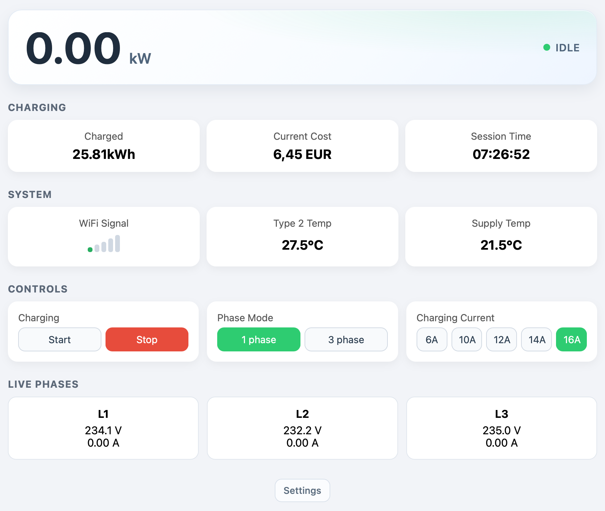

# go-e Charger WebUI Dashboard

A lightweight Node.js dashboard for monitoring and controlling a go-e charger via its local HTTP API.

## Features

- Live charging power hero card (kW) with status indicator
- Charging section with:
  - Status
  - Charged energy (kWh)
  - Dynamic cost calculation in EUR
  - Session time (`cdi` from charger API)
- System section with:
  - WiFi signal strength (5 bars + dBm)
  - Type 2 temperature
  - Supply temperature
- Control section:
  - Charging start/stop
  - Phase switching (1 / 3)
  - Charging current presets (6 / 10 / 12 / 14 / 16 A)
- In-app `Settings` button (bottom) with overlay for:
  - Charger IP/host
  - Energy price (EUR/kWh)
- Live per-phase voltage/current values with active phase highlighting
- Responsive UI for desktop and mobile

## Requirements

- Node.js 18+
- A go-e charger reachable in your local network

## Setup

1. Install dependencies:

```bash
npm install
```

2. Configure charger and pricing in `config.js`:

- `chargerHost` - charger IP/host in your LAN
- `energyPriceEurPerKwh` - electricity price used for cost display
- `requestTimeoutMs` - API timeout for charger requests

3. Start the dashboard:

```bash
npm start
```

4. Open `http://localhost:3000`.

## In-App Settings

Use the `Settings` button at the bottom of the dashboard to change:

- Charger IP/host
- Energy price (EUR/kWh)

These settings are applied immediately and persisted to `config.js`, so they remain after a restart.

## Screenshot


